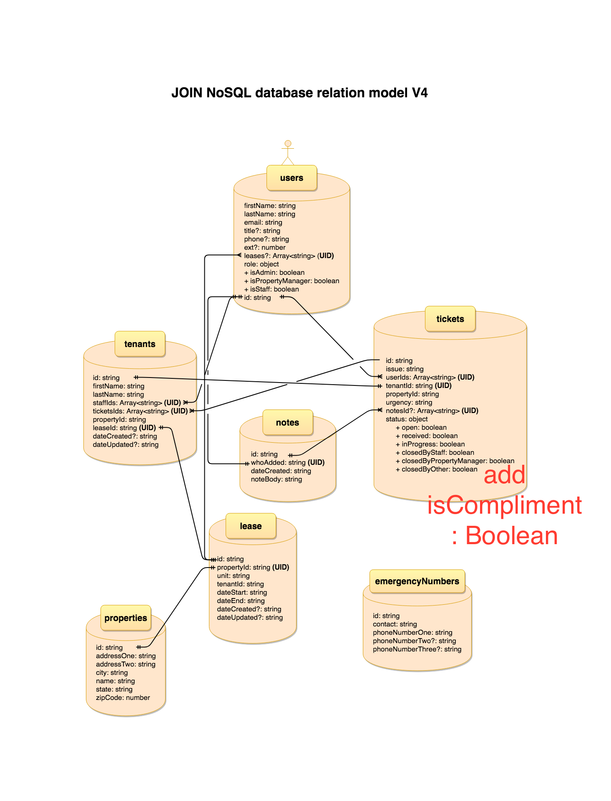

# JOIN API v1
---
## /api/

#### *Staff and Admin access*

#### ACCESS POINT: `https://us-central1-join-thingy-v01.cloudfunctions.net/api/`

#### ENDPOINT: USERS
|method    |route                      | action |
|:---------|:--------------------------|:-------|
|POST      |`v1/users/`                 |Creates a new user |
|GET       |`v1/users/ `                |Gets all users |
|GET       |`v1/users/:uid`             |Gets a single user |
|PATCH     |`v1/users/:uid`             |Updates a single user |
|PUT       |`v1/users/:uid`             |Archives a single user |
|DELETE    |`v1/users/:uid`             |Deletes a single user |

 

#### ENDPOINT: PROPERTIES
|method    |route                      | action |
|:---------|:--------------------------|:-------|
|POST      |`v1/properties/`           |Creates a new property |
|GET       |`v1/properties/ `          |Gets all properties |
|GET       |`v1/properties/:uid`       |Gets a single property |
|PATCH     |`v1/properties/:uid`       |Updates a single property |
|PUT       |`v1/properties/:uid`       |Archives a single property |
|DELETE    |`v1/properties/:uid`       |Deletes a single property |

 

#### ENDPOINT: EMERGENCY NUMBERS
|method    |route                      | action |
|:---------|:--------------------------|:-------|
|POST      |`v1/emergencyNumbers/`     |Creates a new emergency number |
|GET       |`v1/emergencyNumbers/ `    |Gets all emergency numbers |
|GET       |`v1/emergencyNumbers/:uid` |Gets a single emergency number |
|PATCH     |`v1/emergencyNumbers/:uid` |Updates a single emergency number |
|PUT       |`v1/emergencyNumbers/:uid` |Archives a single emergency number |
|DELETE    |`v1/emergencyNumbers/:uid` |Deletes a single emergency number |

 

#### ENDPOINT: TENANTS
|method    |route                      | action |
|:---------|:--------------------------|:-------|
|POST      |`v1/tenants/`              |Creates a new tenant |
|GET       |`v1/tenants/ `             |Gets all tenants |
|GET       |`v1/tenants/:uid`          |Gets a single tenant |
|PATCH     |`v1/tenants/:uid`          |Updates a single tenant |
|PUT       |`v1/tenants/:uid`          |Archives a single tenant |
|DELETE    |`v1/tenants/:uid`          |Deletes a single tenant |

 

#### ENDPOINT: TICKETS
|method    |route                      | action |
|:---------|:--------------------------|:-------|
|POST      |`v1/tickets/`              |Creates a new ticket |
|GET       |`v1/tickets/ `             |Gets all tickets |
|GET       |`v1/tickets/:uid`          |Gets a single ticket |
|PATCH     |`v1/tickets/:uid`          |Updates a single ticket |
|PUT       |`v1/tickets/:uid`          |Archives a single ticket |
|DELETE    |`v1/tickets/:uid`          |Deletes a single ticket |

 

#### ENDPOINT: LEASES
|method    |route                      | action |
|:---------|:--------------------------|:-------|
|POST      |`v1/leases/`              |Creates a new lease |
|GET       |`v1/leases/ `             |Gets all leases |
|GET       |`v1/leases/:uid`          |Gets a single lease |
|PATCH     |`v1/leases/:uid`          |Updates a single lease |
|PUT       |`v1/leases/:uid`          |Archives a single lease |
|DELETE    |`v1/leases/:uid`          |Deletes a single lease |
---

## Local Environment Setup

#### System Dependancies
  * Node v6.11.5 or later
  * npm
  * Firebase tools to interact with the CLI

> note: It's recommended to use the latest versions of node and npm to make es6 syntax and the latest node features available to your environment; typescript will compile to commonjs

#### Setup
  1. `$ git clone https://github.com/AmplifiedHub/join-messenger-db.git`
  2. OPTIONAL: `npm i -g firebase-tools` if no firebase tools are installed
  3. Generate a new ServiceAccountKey.json file
    * go to console.firebase.google.com
    * click the gear next to project overview and select: Users and permissions
    * select: Service accounts from the menu and select Generate new private key
    * rename the downloaded filename to ServiceAccountKey.json and place it in the functions directory of the project `/join-messenger-db/functions/ServiceAccountKey.json`
  4. cd into `/join-messenger-db/functions`
  5. `$ npm install`
  6. `$ firebase login`
  7. follow login instructions, if asked to overwrite anything, select no
  8. `$ npm run build` to generate the lib folder to be served
  9. `$ npm run serve` to start the server on localhost:7777, must be run from `/join-messenger-db/functions`
  10. OPTIONAL: `$ npm run servever` for a verbose debugging script when starting the server

#### Deployment

To deploy functions to firebase:

1. In a terminal, type `npm run build:prod` (which sets Node environment to production)
2. Type `npm run deploy`

As long as you're logged into Firebase, it should deploy the functions

